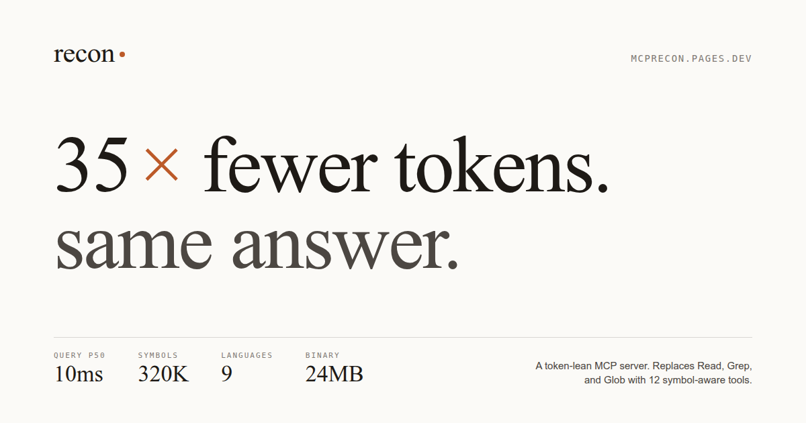

<p align="center">
  
</p>

<h1 align="center">recon</h1>

<p align="center">
  Token-lean code intelligence MCP server.<br/>
  Replaces <code>Read</code>, <code>Grep</code>, and <code>Glob</code> with <strong>20 symbol-aware tools</strong> -- including <strong>graph-aware navigation</strong> (call paths, callers, callees, blast-radius) across <strong>seven languages</strong> -- and a built-in <strong>token-savings counter</strong> so you can prove the win to finance.<br/>
  <strong>15-30x token reduction</strong> on code exploration.
</p>

<p align="center">
  <a href="https://mcprecon.pages.dev">Website</a> · <a href="https://mcprecon.pages.dev/Docs.html">Docs</a> · <a href="https://mcprecon.pages.dev/changelog">Changelog</a> · <a href="#connect-your-agent-hosted">Get Started</a>
</p>

---

Offered as a **hosted MCP server** -- no binary to install, no local indexing. Point your agent at the endpoint, hand it an API key, and it gets 20 symbol-aware tools instantly. **Pro/Team** plans add a savings dashboard at [mcprecon.pages.dev/dashboard](https://mcprecon.pages.dev/dashboard) showing the per-tool token savings your team has booked.

## Benchmarks

Measured on real codebases, release build, warm cache:

| | Zed (80K symbols) | Rust compiler (320K symbols) |
|---|---|---|
| **stats** | 10 ms | 29 ms |
| **find** | 8 ms | 8 ms |
| **search** | 11 ms | 33 ms |
| **outline** | 14 ms | 13 ms |
| **skeleton** | 11 ms | 11 ms |
| **refs** | 8 ms | 12 ms |
| **map (cached)** | 8 ms | 19 ms |
| **map (cold)** | 405 ms | 2.0 s |
| **cold index** | 19 s | 53 s |

All read-path queries under 33 ms on 320K symbols. Binary size: 24 MB.

## Token reduction

Measured on the Rust compiler (318K symbols), recon vs Read/Grep/Glob:

| Scenario | Before | After | Reduction |
|---|---|---|---|
| Read one function | ~23,838 tok | ~111 tok | **215x** |
| Find a symbol | ~17,500 tok | ~226 tok | **77x** |
| Repo orientation | ~52,500 tok | ~2,170 tok | **24x** |
| Find references | ~15,000 tok | ~638 tok | **24x** |
| Outline a file | ~23,838 tok | ~1,350 tok | **18x** |
| Understand a file | ~23,838 tok | ~6,412 tok | **3.7x** |

A typical "find and fix a bug" task: **~3.2K tokens** with recon vs **~100K+** with Read/Grep/Glob.

## Connect your agent (hosted)

### Step 1: Get an API key

Contact us to get a server key for your workspace.

### Step 2: Add to your MCP config

Drop this into `.mcp.json` at your project root:

```json
{
  "mcpServers": {
    "recon": {
      "url": "https://mcp.recon.dev/v1",
      "headers": {
        "Authorization": "Bearer YOUR_API_KEY"
      }
    }
  }
}
```

### Step 3: Teach your agent

Add this to your `CLAUDE.md` (or equivalent agent system prompt):

```markdown
Prefer code_* tools (code_outline, code_skeleton, code_find_symbol,
code_search, code_repo_map) over Read/Grep/Glob for code exploration.
They return structured, token-efficient results.
```

### Step 4: Restart your agent

Restart Claude Code (or your MCP client). The 20 `code_*` tools are now available. Indexing, watching, and ranking all run server-side.

## Setup

```bash
# 1. Authenticate once per machine (caches license globally)
recon login sk-recon-your-key

# 2. In each project: index + set up IDE MCP config
recon init --mcp cc        # Claude Code  (.mcp.json)
recon init --mcp oc        # OpenCode     (.opencode/mcp.json)
recon init --mcp cursor    # Cursor       (.cursor/mcp.json)
recon init --mcp windsurf  # Windsurf     (.windsurf/mcp.json)
recon init                 # Index only, no MCP config

# Your IDE auto-starts recon serve — you never run it manually.
```

Other license commands:

```bash
recon license    # show cached tier, limits, expiry
recon logout     # remove cached license + signal any running serve to exit
```

### Token-savings (Pro/Team)

```bash
# Push today's local rollup to the dashboard (Pro/Team)
recon savings push

# Print local counters as TSV without touching the network
recon savings show

# Auto-push when each `recon serve` session ends
RECON_AUTO_PUSH_SAVINGS=1 recon serve
```

`recon savings push` aggregates the per-tool counters in `.recon/recon.db` (populated by every MCP tool call) and POSTs to the recon worker. Repeated runs on the same day are idempotent (MAX-merged server-side). Free tier returns a clear upgrade message rather than an error.

## Tools (20)

Twelve symbol-and-text primitives, seven graph-aware traversals (added in v0.3.0), and one token-savings counter (added in v0.3.1).

### Symbol & text primitives (12)

| Tool | Replaces | What it does | Latency |
|---|---|---|---|
| `code_outline(path)` | Read | One line per symbol -- kind, name, line | 13 ms |
| `code_skeleton(path)` | Read | Signatures + docs, bodies as `...` (10x compression) | 11 ms |
| `code_read_symbol(path, symbol)` | Read | Full source of one symbol + callers | <10 ms |
| `code_find_symbol(name)` | Grep | 3-tier: exact SQLite -> Tantivy BM25 -> FTS5 + nucleo fuzzy | 8 ms |
| `code_find_refs(symbol)` | Grep | Reference count + top-k call sites | 12 ms |
| `code_search(query, mode, filter?)` | Grep | exact/regex/hybrid + filter DSL, Tantivy-first | 33 ms |
| `code_list(glob?, lang?, filter?)` | Glob | Structured file listing with symbol counts (batch query) | 57 ms |
| `code_repo_map(budget)` | -- | PageRank-ranked symbol overview, cached in SQLite | 19 ms |
| `code_find_strings(pattern)` | -- | Search string literals and comments | <30 ms |
| `code_multi_find(patterns[])` | -- | Multi-pattern search in one call | <30 ms |
| `code_reindex()` | -- | Agent-triggered re-indexing, clears map cache | varies |
| `code_stats()` | -- | Index health, top-N centrality, live token-savings block | 10 ms |

### Graph-aware traversal (7) -- v0.3.0+

A single bounded BFS over the cached forward+reverse CSR call graph replaces the canonical chained-`code_find_refs` agent loop. Total-visit cap 50 000 nodes, per-tier fan-out cap 50; god-node queries terminate with `truncated: true` rather than blowing up the response.

| Tool | Replaces | What it does | Latency |
|---|---|---|---|
| `code_path(src, dst, max_hops?)` | chained refs | Shortest call-graph path between two symbols (bidirectional BFS, max 8 hops). | <5 ms |
| `code_callers(symbol, depth?)` | chained refs | Transitive callers up to N rings (default 1, max 6). Cycle-safe; tiered. | <10 ms |
| `code_callees(symbol, depth?)` | chained refs | Transitive callees up to N rings -- what does X call (directly + transitively)? | <10 ms |
| `code_context(symbol, budget?)` | 4-call understand-X loop | One-shot bundle: signature + body + callers + callees + types + tests. Token-budgeted. | 12 ms |
| `code_impact(symbol, depth?)` | -- | Blast radius -- transitive callers + reachable test functions. | <15 ms |
| `code_subsystems(limit?)` | -- | Weakly-connected components of the reference graph, ranked by hub. | <15 ms |
| `code_subsystem(id, budget?)` | -- | Drill into one subsystem with a token-budgeted skeleton. | <10 ms |

### Token-savings counter (1) -- v0.3.1+

| Tool | Replaces | What it does | Latency |
|---|---|---|---|
| `code_savings()` | -- | Per-tool TSV: calls, response tokens, baseline avoided, tokens saved, avg latency. Lifetime totals persist across restarts. Model-agnostic -- reports tokens, leaves dollar conversion to your provider's rate sheet. | <5 ms |

The same numbers also surface as a `telemetry` block on every `code_stats` call -- so dashboards can poll a single endpoint.

### Filter DSL

Search tools accept an optional `filter` parameter:

```
*.rs                   # extension filter
type:rust              # language type
status:modified        # git-modified files only
!test                  # exclude paths containing "test"
/src/                  # path segment match
```

## Architecture

```
crates/
  recon-core/       # Types, errors, 5 output shapes, config, secret redaction
  recon-parser/     # Tree-sitter pools (9 langs), symbol extraction
  recon-storage/    # SQLite + FTS5 trigram, blake3, batch inserts
  recon-search/     # Tantivy BM25, fff-grep, nucleo fuzzy, PageRank, token counting
  recon-embed/      # fastembed + LanceDB vector search (feature-gated)
  recon-indexer/    # Merkle tree, gix ColdStart, file watcher, rayon parallel parse
  recon-server/     # rmcp MCP handler, 20 tools, parking_lot Mutex, redaction,
                    # call graph (forward+reverse CSR), telemetry counters,
                    # shutdown-on-revocation notify
  recon-cli/        # CLI: login, init, serve, index, purge, query, savings
```

### Search tiers

| Tier | Backend | Latency |
|---|---|---|
| T0 -- Symbol exact | SQLite btree index | <1 ms |
| T1 -- Symbol fuzzy | SQLite FTS5 trigram + nucleo rescore | 2-8 ms |
| T2 -- Structured BM25 | Tantivy with CodeSplitTokenizer | 5-15 ms |
| T3 -- Raw text/regex | fff-grep (SIMD + memmap2) | 3-95 ms |
| T4 -- Semantic | fastembed + LanceDB (feature-gated) | 50-150 ms |

### Incremental indexing

1. **ColdStart** -- gix reads HEAD SHA. If unchanged since last index, skip entirely.
2. **Merkle diff** -- blake3 hash tree. On HEAD change, reindex only changed files.
3. **Full index** -- first run, parallel parse via rayon.
4. **Live watcher** -- notify-debouncer-full (250 ms debounce) triggers per-file reindex.

### PageRank repo map

`code_repo_map` builds a directed graph from symbol references, applies Aider-style edge weights (10x long identifiers, 0.1x private names, 50x focus files), runs power iteration with early convergence, and renders the top-ranked symbols within a token budget. Result is cached in SQLite, keyed on `max(indexed_at)` -- invalidates automatically on any reindex.

### Call graph (v0.3.0+)

Same `Symbol` + `Ref` substrate, different shape: a forward + reverse CSR adjacency built lazily on first graph-tool call after each reindex. Edge resolution mirrors PageRank's name-based lookup so the two views agree. Indices are `u32` for cache locality (graphs ≤ 4 B nodes); no weights stored (BFS doesn't need them); reverse CSR is just the transposed forward edges, ~16 MB for 1 M edges. Backs all seven graph-traversal tools. Path queries use bidirectional BFS for `O(b^(d/2))` scaling; layered BFS for callers/callees with cycle-safe visited sets and per-tier fan-out caps.

### Multi-language parser parity (v0.3.1+)

All seven supported languages -- Rust, Python, JavaScript/TypeScript/TSX, Go, Java, C/C++ -- now walk function/method/class/struct bodies and emit identifier refs from a proper identifier arm. Before v0.3.1 the call graph was structurally empty for non-Rust files; today the graph-traversal tools work cross-language with parity. Per-language regression tests in `recon-parser::extract::tests` lock the behavior in.

### Token-savings counter (v0.3.1+)

`crates/recon-server/src/telemetry.rs` tracks per-tool atomic counters (calls, response tokens, baseline tokens avoided, latency micros). The hot path is 4 `Relaxed` atomic adds plus one `tiktoken-rs` pass over the response (~250 µs for a 2 KB response). Lifetime totals persist to the SQLite `meta` table under `tel:tool:<name>` keys; flushes are async via `tokio::spawn_blocking`, never blocking tool latency. Per-tool baselines are static, audit-friendly constants documented in `BASELINES`; recon reports tokens, leaves dollar conversion to your provider's rate sheet (Claude / GPT / Gemini / self-hosted -- your rates, your math).

### Pro/Team savings dashboard (v0.3.2+)

The same telemetry plus a Pro/Team-only dashboard at [mcprecon.pages.dev/dashboard](https://mcprecon.pages.dev/dashboard). The CLI pushes one daily rollup per (user, day) via `POST /v1/account/savings`; the dashboard pulls a tier-capped range (Pro 30 d / Team 90 d / Enterprise 365 d) via `GET /v1/dashboard/savings`. Worker-side upsert is `MAX`-merged on `(user_id, day)` PK -- monotone (a stale push never regresses a stored counter) and idempotent. Pull endpoint is one D1 round-trip: equality+range scan on the PK, JS-side fold over ≤365 rows for totals (cheaper than a second SUM round-trip).

What travels: six integers per day per user. **No code, no symbol names, no file paths, no query strings.** Free tier never pushes. Set `RECON_AUTO_PUSH_SAVINGS=1` to push automatically when each `recon serve` session ends.

### Shutdown lifecycle (v0.3.2+)

`recon serve` exits cleanly on five user-initiated triggers: IDE close (transport EOF), SIGINT/SIGTERM, **license revocation**, **account deletion**, and **`recon logout` against a running session**. The last three are detected within ≤ `RECON_LICENSE_REVALIDATE_SECS` (default 900) by the periodic re-validation task, which fires `ReconServer::request_shutdown()` -- a `tokio::sync::Notify` the serve loops select on alongside their existing signal and transport-close waiters. Without this, a deleted account would leave `recon serve` running forever, holding watchers and ports while refusing tool calls.

## Performance engineering

- **mimalloc** global allocator
- **parking_lot::Mutex** instead of tokio::sync::Mutex (no async overhead on sync SQLite)
- **DashMap** for multi-tenant repo routing (sharded RwLock, zero contention on reads)
- **Fat LTO + panic=abort + opt-level=3** -- 24 MB binary
- **SQLite tuning** -- WAL, mmap 256MB, cache 32MB, PRAGMA optimize, chunked bulk inserts (500 files/tx)
- **Tantivy-first search** -- try BM25 index before falling back to grep, 50MB heap, commits every 20K docs
- **Token heuristic** -- estimate_tokens (len/4) in hot loops, tiktoken for accuracy checks
- **Map caching** -- PageRank cached in SQLite meta, invalidated on max(indexed_at) change
- **Early convergence** -- PageRank stops when L1 norm delta < 1e-6 (typically 8-12 iterations)
- **ahash::AHashMap** -- non-cryptographic hash in PageRank and RRF fusion hot paths
- **Bulk SQL** -- all_symbols() and all_refs() single-query loads for PageRank
- **Secret redaction** -- regex scanner on all tool responses returning code content
- **Path traversal guard** -- canonicalize + prefix check, repo root cached
- **Stdout hygiene** -- all logging to stderr, verified by CI test

## Testing

```bash
cargo test --workspace           # 490 Rust tests across the workspace
cargo clippy --workspace --all-targets -- -D warnings
```

Plus a TypeScript/Vitest suite in `worker/`:

```bash
cd worker
npm test                          # 105 worker tests across 8 files
```

- Zero `unwrap()` in production library code
- `#[deny(missing_docs)]` on all 7 crate roots
- Secret redaction on all code-returning tool responses
- Stdout hygiene subprocess test
- Self-host E2E (index this repo, verify symbols)
- Incremental E2E (cold index, HEAD skip, merkle diff, delete cascade)
- Tool description length enforcement (<2 KB each)

## ADRs

- [000 -- Symbol-first architecture](docs/adr/000-symbol-first-architecture.md)
- [001 -- Text search backend](docs/adr/001-text-search-backend.md)
- [002 -- Output shape discipline](docs/adr/002-output-shape-discipline.md)
- [003 -- Stdio transport hygiene](docs/adr/003-stdio-transport-hygiene.md)

## License

MIT OR Apache-2.0
